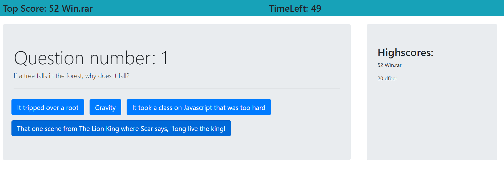

Homework 4 - Javascript Quiz
## This quiz website features:

  -10 questions that are kind of, sort of, maybe, related to Javascript in some way.
  -On page load local storage is checked to see if there are any highscores saved. If there are they are added to the high scores.
  -A start button that activates the timer and the first question.
  -There are four answer buttons. When any is clicked they check if they were the correct answer and advance to the next question.
  -If they are correct then 10 points are added to the score.
  -The Timer counts down from 60 seconds, 10 seconds are taken off for each wrong answer.
  -For final scoring, if you finish all questions you get +.5 bonus points for each second left.
  -When either the time goes below zero or questions run out the user to prompted to enter their name.
  -The highscore is added to the highscores and local storage and the quiz is reset.

License: 
